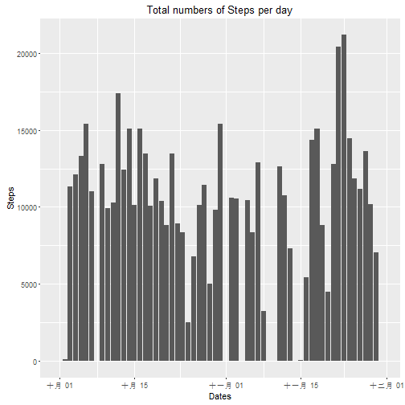
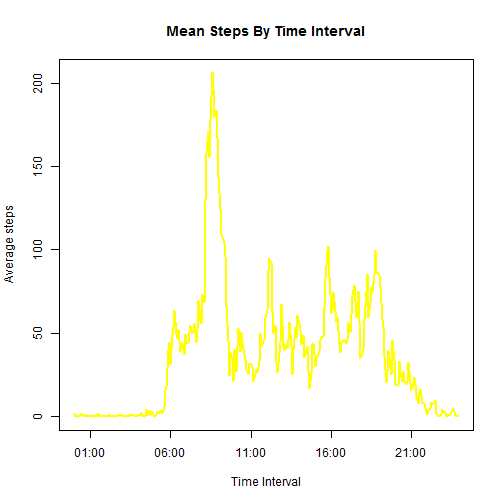
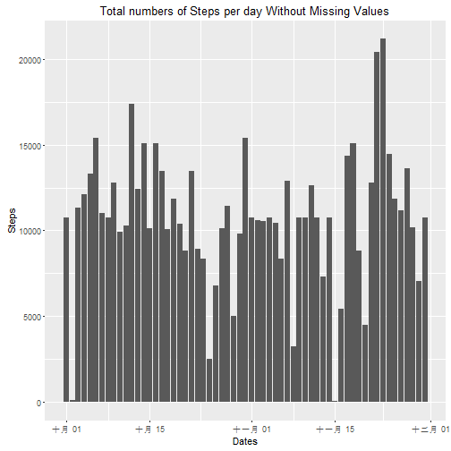
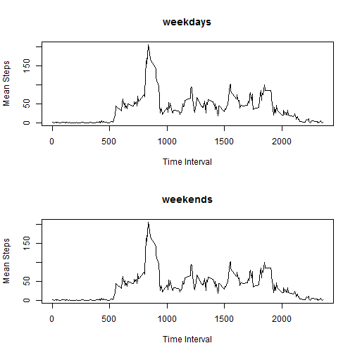

title: "Reproducible Research: Peer Assessment 1"
===========================================================


## Loading and preprocessing the data
####Loading the data:

```r
setwd("D:/coursea/w2/repdata_data_activity")
act <- read.csv("activity.csv",header = TRUE)
```

####Preprocessing the data:  
Transfer the 'date' column to date format and the 'interval' column to time format  
Then combine them in 'time' column

```r
act$date <- as.POSIXct(strptime(act$date, "%Y-%m-%d"),tz="")
## make the interval show 4 digits in new 'time' coloum
act$time <- sprintf("%04d", act$interval)
act$time <- as.POSIXct(act$time, "%H%M",tz="")
```

####Showing the preprocessed data:

```r
head(act,n=10)
```

```
##    steps       date interval                time
## 1     NA 2012-10-01        0 2016-07-11 00:00:00
## 2     NA 2012-10-01        5 2016-07-11 00:05:00
## 3     NA 2012-10-01       10 2016-07-11 00:10:00
## 4     NA 2012-10-01       15 2016-07-11 00:15:00
## 5     NA 2012-10-01       20 2016-07-11 00:20:00
## 6     NA 2012-10-01       25 2016-07-11 00:25:00
## 7     NA 2012-10-01       30 2016-07-11 00:30:00
## 8     NA 2012-10-01       35 2016-07-11 00:35:00
## 9     NA 2012-10-01       40 2016-07-11 00:40:00
## 10    NA 2012-10-01       45 2016-07-11 00:45:00
```

```r
summary(act)
```

```
##      steps             date               interval     
##  Min.   :  0.00   Min.   :2012-10-01   Min.   :   0.0  
##  1st Qu.:  0.00   1st Qu.:2012-10-16   1st Qu.: 588.8  
##  Median :  0.00   Median :2012-10-31   Median :1177.5  
##  Mean   : 37.38   Mean   :2012-10-31   Mean   :1177.5  
##  3rd Qu.: 12.00   3rd Qu.:2012-11-15   3rd Qu.:1766.2  
##  Max.   :806.00   Max.   :2012-11-30   Max.   :2355.0  
##  NA's   :2304                                          
##       time                    
##  Min.   :2016-07-11 00:00:00  
##  1st Qu.:2016-07-11 05:58:45  
##  Median :2016-07-11 11:57:30  
##  Mean   :2016-07-11 11:57:30  
##  3rd Qu.:2016-07-11 17:56:15  
##  Max.   :2016-07-11 23:55:00  
## 
```
## What is mean total number of steps taken per day?
1. Use the aggregate() function to compute the sum of steps per day  
2. Use mean() and median() function to get the result

```r
total_steps_perDay <- aggregate(list(totalSteps=act$steps),by=list(date=act$date),
                                FUN=sum, na.rm=TRUE)
mean(total_steps_perDay$totalSteps)
```

```
## [1] 9354.23
```

```r
median(total_steps_perDay$totalSteps)
```

```
## [1] 10395
```

The histgram below illustrate the total steps distribution:

```r
library(ggplot2)
g=ggplot(total_steps_perDay,aes(date,totalSteps))
g+geom_bar(stat = "identity")+xlab("Dates")+ ylab("Steps")+
    labs(title= "Total numbers of Steps per day")
```



## What is the average daily activity pattern?
1. Use the aggregate() function to compute the mean steps per day  
2. Use the plot() function to print the Time series plot of the average number of steps taken  

```r
mean_steps_perDay_byTime <- aggregate(list(averageSteps=act$steps), by=list(time=act$time, 
    interval=act$interval), FUN=mean, na.rm=TRUE)
plot(averageSteps ~ time, data = mean_steps_perDay_byTime, xlab = "Time Interval", 
    ylab = "Average steps", main = "Mean Steps By Time Interval", type = "l", col = "yellow", 
    lwd = 2)
```



Use the which.max function to find the maximum mean number of step in average 5-miniutes interval.

```r
mean_steps_perDay_byTime[which.max(mean_steps_perDay_byTime$averageSteps),
                         c('interval','averageSteps')]
```

```
##     interval averageSteps
## 104      835     206.1698
```
## Imputing missing values
Compute missing values

```r
sum(is.na(act$steps))
```

```
## [1] 2304
```
Create new datafram without missing value

```r
library(dplyr)
new_act <- act %>%
           group_by(interval) %>%
           mutate(steps = ifelse(is.na(steps), mean(steps, na.rm=TRUE), steps))
```
The histgram below illustrate the new total steps distribution without missing value

```r
new_total_steps_perDay <- aggregate(list(totalSteps=new_act$steps),by=list(date=new_act$date),
                                FUN=sum, na.rm=TRUE)
library(ggplot2)
g=ggplot(new_total_steps_perDay,aes(date,totalSteps))
g+geom_bar(stat = "identity")+xlab("Dates")+ ylab("Steps")+
    labs(title= "Total numbers of Steps per day Without Missing Values")
```



## Are there differences in activity patterns between weekdays and weekends?
1. Create a 'weekday' column and a 'dayIndicator' factor column to indicate the weekdays and weekends  
2. Show the new datafram with weekday Indicator

```r
new_act$weekDay <- weekdays(new_act$date)
new_act$dayIndicator <- as.factor(apply(new_act[,"weekDay"], 1, 
                                        function(x) {
                                            switch(x, Sunday = "weekend", Saturday = "weekend",
                                                   "weekday")
                                                     }))
head(new_act,n=10)
```

```
## Source: local data frame [10 x 6]
## Groups: interval [10]
## 
##        steps       date interval                time weekDay dayIndicator
##        <dbl>     <time>    <int>              <time>   <chr>       <fctr>
## 1  1.7169811 2012-10-01        0 2016-07-11 00:00:00  星期一      weekday
## 2  0.3396226 2012-10-01        5 2016-07-11 00:05:00  星期一      weekday
## 3  0.1320755 2012-10-01       10 2016-07-11 00:10:00  星期一      weekday
## 4  0.1509434 2012-10-01       15 2016-07-11 00:15:00  星期一      weekday
## 5  0.0754717 2012-10-01       20 2016-07-11 00:20:00  星期一      weekday
## 6  2.0943396 2012-10-01       25 2016-07-11 00:25:00  星期一      weekday
## 7  0.5283019 2012-10-01       30 2016-07-11 00:30:00  星期一      weekday
## 8  0.8679245 2012-10-01       35 2016-07-11 00:35:00  星期一      weekday
## 9  0.0000000 2012-10-01       40 2016-07-11 00:40:00  星期一      weekday
## 10 1.4716981 2012-10-01       45 2016-07-11 00:45:00  星期一      weekday
```
The plots below illustrate the mean steps daily without missing value between weekdays and weekends

```r
par(mfrow=c(2,1))
weekDay_steps <- aggregate(steps ~ interval, data=new_act, subset=
                             (new_act$dayIndicator=="weekday"), FUN=mean)
weekEnd_steps <- aggregate(steps ~ interval, data=new_act, subset=
                             (new_act$dayIndicator=="weekend"), FUN=mean)##
```

```
## Error in aggregate.data.frame(mf[1L], mf[-1L], FUN = FUN, ...): no rows to aggregate
```

```r
plot(weekDay_steps,xlab="Time Interval",ylab="Mean Steps",main="weekdays",type = 'l'  )
plot(weekEnd_steps,xlab="Time Interval",ylab="Mean Steps", main="weekends",type='l'  )
```


